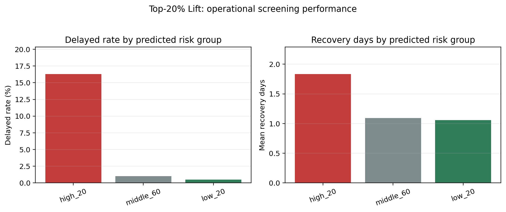
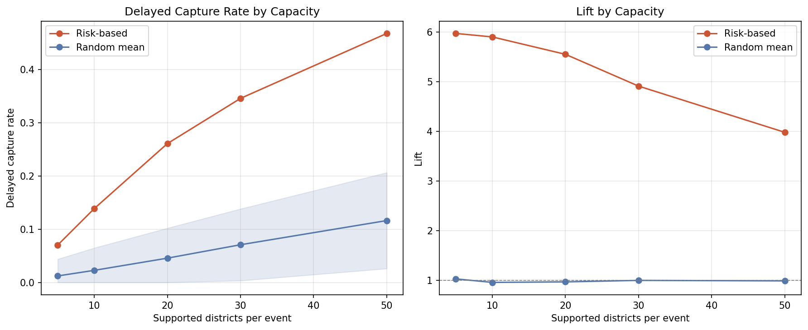
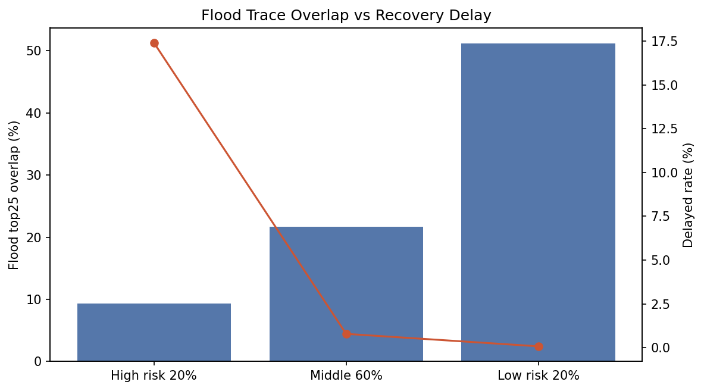
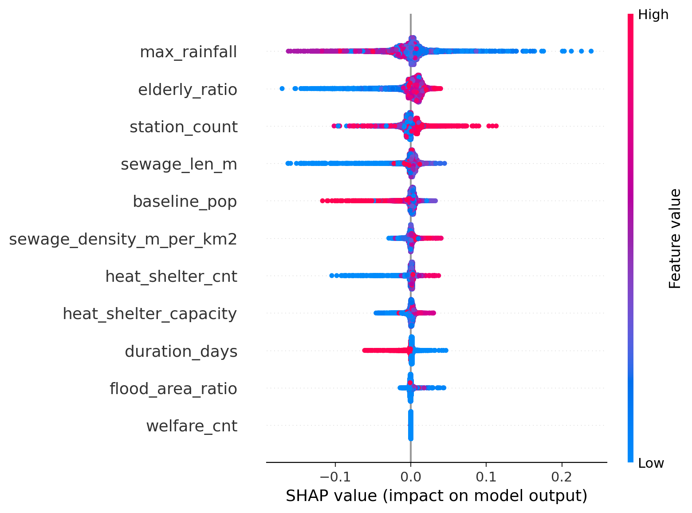

# 분석 보고서

## 기본 정보

| 항목 | 내용 |
|---|---|
| 부문 | ☑ 자유분석 ☐ 지정분석 |
| 팀명 | 1인 참가 |
| 과제명 | 침수위험과 회복지연위험은 다르다: 집중호우 이후 서울 행정동 생활서비스 회복지연 Top-K 선별 모델 |
| 미션 | ☐ 자연환경 ☑ 생활환경 ☐ 대기환경 ☑ 물환경 ☑ 환경일반 ☐ 에너지산업 ☐ 에너지효율 ☐ 미래에너지 ☐ 에너지환경 |

## 활용 데이터

| 구분 | 데이터 |
|---|---|
| 공공 | 서울 열린데이터광장 행정동 생활인구 일별 데이터(2023.06~2025.09), 기상자료개방포털 AWS 자동기상관측 일별·시간별 강수 데이터(서울 27개 지점), 기상자료개방포털 ASOS 일별 기상 관측 데이터(서울 종로 108번 지점), 서울시 행정동 경계 데이터, 서울시 무더위쉼터 위치·용량 데이터(2025년 4,107개소, 임시지원시설 접근성 proxy), 서울시 침수흔적도 SHP(2023·2024·2025년), 서울시 하수도 관거 통계 및 하수관거 데이터, 행정복지센터 위치 데이터, 행정동 코드 매핑 자료 |
| 민간 | 해당 없음. 본 제출본은 공공 데이터만으로 분석 구성 |

## Ⅰ. 과제 개요 및 가설

### 1. 분석 배경

서울시는 여름철 집중호우가 반복적으로 발생하며, 강수 종료 후에도 일부 행정동에서는 생활인구가 수일간 기준 수준으로 복귀하지 못하는 현상이 나타난다. 예를 들어 2023년 7월 13일, 2024년 7월 17~18일, 2025년 8월 13일과 같은 주요 호우 사례에서 일부 행정동은 D+3까지도 생활인구 회복률이 90% 미만에 머물렀다.

그러나 현행 재난대응 체계는 침수위험 예측, 사전 대피, 위험지도 중심으로 고도화되어 있는 반면, 호우 이후 행정동 단위 생활서비스 회복 모니터링과 복구자원 우선배치 기준은 상대적으로 부족하다. 실제 현장에서는 치수과, 청소행정과, 동주민센터, 복지 부서 등이 점검반·청소차·복지 인력을 배치해야 하지만, 어느 동부터 확인해야 하는지에 대한 정량적 근거가 제한적이다.

본 연구는 “집중호우 이후 어느 행정동이 생활회복 지연 위험이 높은가”를 강수 종료 직후 또는 D+1 초기 단계에서 선별하고, 제한된 복구자원을 어디에 먼저 투입해야 D+3·D+7 회복 모니터링에서 누락을 줄일 수 있는지 제안하는 운영형 분석 패키지이다.

본 과제는 장기 기후변화 시나리오 기반 취약성 예측이 아니라, 실제 관측된 호우 이후 행정동별 생활회복 속도의 차이를 분석하여 단기 복구자원 우선배치를 지원하는 것을 목적으로 한다. 즉, 기존 침수위험 지도가 “어디가 물리적으로 잠길 수 있는가”를 설명한다면, 본 모델은 “비가 그친 뒤 어디의 생활활동 회복이 늦어 행정 복구자원을 먼저 배치해야 하는가”를 선별한다.

다만 본 제출본은 민원 건수, 현장점검 건수, 수해 폐기물 수거량, 피해신고 건수 같은 관측 행정수요를 직접 예측하지 않는다. 현재 모델의 직접 산출 대상은 생활인구 회복지연, 고노출 지역, 배수·침수 병목, 생활지원 공백을 종합한 잠재 행정수요 우선점검 후보이다. 관측 행정수요 자료는 확보될 경우 외부 검증에 추가하는 보강 단계로 둔다.

### 2. 핵심 가설

본 연구는 정책 투입의 인과효과를 직접 식별하지 않는다. 대신 행정 운영 관점에서 검증 가능한 다음 가설을 설정한다.

**가설 1.** 집중호우 이후 D+1~D+3 생활인구 회복률 저하는 강수 규모와 지속시간만이 아니라, 생활인구 노출, 하수도·배수 인프라, 고령층 비율, 지원시설 접근성 등 행정동의 구조적 특성에 의해 설명된다.

**가설 2.** 회복률 절대값을 정밀 예측하는 것보다, 회복지연 위험 상위 행정동을 Top-K 방식으로 선별하는 랭킹 모델이 제한된 복구자원 배치 의사결정에 더 적합하다.

**가설 3.** 강수 종료 직후 또는 D+1 운영 단계에서 위험 상위 20% 행정동을 선별하면, 무작위 선별 대비 실제 회복지연 동을 더 높은 비율로 포착할 수 있다.

**가설 4.** 위험 상위 동을 SHAP 기반으로 유형화하면 배수·침수 병목형, 고노출 회복지연형, 생활지원 공백형 등 행정 조치로 연결 가능한 플레이북을 만들 수 있다.

### 3. 검증 설계

2023~2025년 여름철(6~9월) 서울 집중호우 이벤트 29개와 행정동 426개를 결합한 총 12,354건의 event x district 패널 데이터를 구성하였다. XGBoost 회귀 모델을 통해 D+1~D+3 최저 생활인구 회복률을 예측하고, 예측값을 위험점수로 전환하여 행정동별 우선순위를 산출하였다.

일반화 가능성은 2025년 holdout 검증과 Leave-One-Event-Out(LOEO) 교차검증으로 평가하였다. 단, 본 연구의 중심 성능지표는 R2가 아니라 Precision@K, Recall@K, Lift@K 등 우선순위 선별 성능이다.

검증은 3층으로 재구성하였다.

| 단계 | 검증 질문 | 본 제출본의 처리 |
|---|---|---|
| 1차 내부 검증 | 생활인구 회복지연 위험 상위 동을 잘 선별하는가 | LOEO, year holdout, Top-K 성능으로 검증 |
| 2차 보조 검증 | 물리적 침수흔적 및 대표 사례와 함께 운영 해석이 가능한가 | 침수흔적 overlap, 3개 대표 호우 사례로 보조 해석 |
| 3차 직접 행정수요 검증 | 민원·점검·폐기물·피해신고 실적과 같은 방향인가 | 현재 원자료 없음, 템플릿과 스크립트 제공 |

## Ⅱ. 분석 환경 및 데이터

### 1. 분석 환경

| 항목 | 내용 |
|---|---|
| 언어 | Python 3.11, conda 가상환경 `recovery` |
| 핵심 라이브러리 | pandas, geopandas, xgboost, shap, statsmodels, scikit-learn, optuna, folium, matplotlib, seaborn, pyarrow |
| IDE | VS Code, Jupyter Notebook |
| 저장 포맷 | 전처리 데이터: Apache Parquet / 최종 산출물: CSV, PNG, HTML, Markdown |
| 재현 방법 | `notebooks/01_data_collection.ipynb`부터 `20_flood_trace_validation.ipynb`까지 순차 실행 후 보강 스크립트 실행 |
| 보강 스크립트 | `scripts/generate_operational_evidence.py`, `scripts/external_validation.py`, `scripts/build_case_story.py` |
| 데모 앱 | `app/streamlit_app.py` |

보고서 보강 산출물은 아래 명령으로 재생성한다.

```powershell
python scripts/generate_operational_evidence.py
python scripts/external_validation.py
python scripts/build_case_story.py
```

상황실형 대시보드는 아래 명령으로 실행한다.

```powershell
python -m streamlit run app\streamlit_app.py --server.port=8503
```

### 2. 데이터 전처리

#### 생활인구 데이터

서울시 행정동 생활인구 일별 CSV 12개 파일(2023.06~2025.09)을 수집하여 `living_pop_daily.parquet`로 통합하였다. 원시 데이터에는 시간대구분 코드가 혼재되어 있어 `시간대구분 = 0`인 일별합계 행만 필터링하였다. 이 처리를 하지 않으면 시간대별 행까지 함께 집계되어 데이터가 약 25배 팽창하는 오류가 발생한다.

생활인구 행정동 코드와 공간 경계 행정동 코드의 불일치는 행정동 코드 매핑 자료를 사용해 정합하였다.

#### 호우 이벤트 정의

AWS 27개 지점 중 1개소 이상에서 일강수량 50mm 이상을 기록한 날을 이벤트 후보로 추출하였다. 동일 날짜에 여러 지점이 기준을 초과하면 단일 이벤트로 병합하였고, 연속 강수는 하나의 이벤트로 처리하였다. 기준선 확보와 회복창 확보가 가능한 최종 분석 이벤트는 29개이다.

#### 종속변수 설계

각 이벤트와 행정동에 대해 D-14~D-1 기준 생활인구 평균을 `baseline_pop`으로 정의하였다. 이후 D+1~D+14 각 일의 회복률을 다음과 같이 계산하였다.

```text
recovery_rate = 해당일 생활인구 / baseline_pop
```

주요 종속변수와 라벨은 다음과 같다.

| 변수 | 정의 |
|---|---|
| `min_recovery_rate_d1_d3` | D+1, D+2, D+3 중 최저 생활인구 회복률 |
| `recovery_days` | 회복률 90% 이상이 2일 연속 관측되는 첫 회복일 |
| `delayed` | `recovery_days >= 4일`이면 1, 아니면 0 |

`delayed` 비율은 약 4% 수준으로 낮아 분류 모델 단독 학습에는 불균형 문제가 크다. 따라서 본 연구는 연속형 회복률을 회귀 타깃으로 사용하고, 예측값을 위험점수로 전환하여 랭킹 선별에 활용하였다.

#### 파생 피처 설계

| 피처 | 유형 | 설계 근거 |
|---|---|---|
| `max_rainfall` | 동적 | 이벤트 강도 |
| `station_count` | 동적 | 강수 공간 범위 |
| `duration_days` | 동적 | 이벤트 지속일수 |
| `baseline_pop` | 정적 | 평상시 생활인구 노출 |
| `elderly_ratio` | 정적 | 고령층 취약성 |
| `flood_area_ratio` | 정적 | 과거 침수흔적 면적 비율 |
| `sewage_len_m` | 정적 | 하수도 인프라 규모 |
| `sewage_density_m_per_km2` | 정적 | 면적 대비 하수관거 밀도 |
| `welfare_cnt` | 정적 | 행정복지 접근성 |
| `heat_shelter_cnt` | 정적 | 평시 공공대피·휴식 인프라를 활용한 임시지원시설 접근성 proxy |
| `heat_shelter_capacity` | 정적 | 평시 공공대피·휴식 인프라를 활용한 임시지원시설 수용력 proxy |

#### 결측치 처리

- 강수 미기록일은 강수 없음으로 보고 0으로 대체하였다.
- 공간 조인 후 쉼터·복지시설이 없는 행정동은 0으로 채웠다.
- 최종 `model_ready.parquet` 기준 핵심 모델 컬럼의 결측이 없음을 확인하였다.

### 3. 데이터 융합

| 결합 | 방식 |
|---|---|
| 생활인구 x 공간 경계 | 행정동 코드 매핑 후 `adm_cd` 기준 결합 |
| 생활인구 x 기상 이벤트 | 이벤트 D0 기준 D-14~D+14 시간 창 생성 후 날짜 기준 결합 |
| 시설 위치 x 행정동 | GeoPandas spatial join, EPSG:4326 통일 |
| 침수흔적도 x 행정동 | 폴리곤 교차 면적을 행정동 면적으로 나누어 `flood_area_ratio` 산출 |
| 기상 x 행정동 | 기본 모델은 이벤트 단위 강수, 보조 분석은 nearest AWS 지점 기반 국지 강수노출 사용 |

정합성 검증 결과 최종 분석 패널은 29개 호우 이벤트 x 426개 행정동, 총 12,354행으로 구성되었다.

민원·폐기물·현장점검 실적 데이터는 현재 원자료가 확보되지 않아 직접 결합하지 않았다. 대신 `data/external/external_validation_template.csv`와 `scripts/external_validation.py`를 구성하여 향후 실적 데이터가 확보되면 Top20/Bottom20 외부 검증으로 확장할 수 있게 하였다. 따라서 본 제출본은 관측 행정수요 검증 완료가 아니라, 잠재 행정수요 선별 모델과 직접 검증 확장 설계를 함께 제시하는 형태이다.

## Ⅲ. 분석 방법 및 모델링

### 1. 방법론 타당성

#### 왜 회귀 모델인가

`delayed=1` 비율이 약 4%로 낮아 단순 분류 모델은 불균형 문제에 취약하다. 반면 `min_recovery_rate_d1_d3`는 연속형 지표이며, 회귀 예측값을 위험점수(`risk_score = 1 - predicted_min_recovery_rate`)로 변환하면 이벤트별 우선순위 산출에 바로 활용할 수 있다.

#### 왜 XGBoost인가

피처 수는 많지 않지만, 강수 충격과 행정동 구조적 특성 간 비선형 상호작용이 예상된다. XGBoost는 이러한 관계를 포착할 수 있고, SHAP을 통해 개별 예측의 위험 사유를 설명할 수 있어 행정 의사결정에 적합하다.

Ridge 회귀 베이스라인은 설명력이 거의 없었고, XGBoost는 2025 holdout 기준 일정한 설명력을 보였다. 다만 새로운 호우 이벤트에 대한 절대값 예측 일반화는 제한적이므로, 본 연구는 R2보다 Top-K 랭킹 성능을 중심으로 평가한다.

#### 왜 Event FE 회귀를 추가했는가

XGBoost는 예측과 랭킹에는 유용하지만 계수 해석에는 적합하지 않다. 따라서 이벤트 고정효과와 클러스터-로버스트 표준오차를 활용한 보조 회귀를 수행하여 행정동 특성 변수의 설명적 관련성을 점검하였다. 이는 인과효과 추정이 아니라 관련성 검토이다.

### 2. 분석 프로세스

```text
[1] 원시 데이터 수집 및 전처리
    living_pop_daily.parquet / aws_daily.parquet / feature_spatial.parquet

[2] 호우 이벤트 탐지 및 시간 창 구성
    events.csv → event_windows.parquet → baseline_pop.parquet

[3] 회복률 지표 산출
    recovery_daily.parquet → master_label.parquet
    min_recovery_rate_d1_d3, recovery_days, delayed 생성

[4] 모델 학습 데이터셋 구성
    model_ready.parquet
    29개 이벤트 x 426개 행정동 = 12,354행

[5] 모델 학습 및 튜닝
    Ridge baseline → XGBoost + Optuna

[6] 검증
    Year holdout, Leave-One-Event-Out

[7] 설명 분석
    SHAP beeswarm, SHAP waterfall, feature importance

[8] 유형화
    SHAP 기여값 기반 K-means(k=3)

[9] 의사결정 패키지
    event_priority_table, historical_priority_table, playbook_table

[10] What-if 및 capacity scenario
     균등, 위험기반, 유형맞춤, 취약계층 가중, Top-K 자원 용량 제약 비교

[11] 강건성 및 방어 검증
     target sensitivity, duration_days 제외 모델, 침수흔적 overlap, 국지 강수노출 보조 분석
```

### 3. 인과 추론 적용 범위

본 과제는 다음 내용을 인과효과로 주장하지 않는다.

- 하수도 개선이 회복률을 얼마나 높이는지
- 복지시설 확충이 delayed를 얼마나 줄이는지
- 청소차나 점검반 투입이 실제 정책효과로 얼마의 개선을 만드는지

대신 다음과 같이 해석 범위를 제한한다.

- SHAP과 feature importance는 설명적 관련성이다.
- Event FE 회귀는 이벤트 간 강수 차이를 통제한 보조 관련성 분석이다.
- What-if와 capacity scenario는 동일 가정하 배치전략별 상대 효율을 비교한 민감도 분석이다.

### 4. 신뢰도 검증

#### 회귀 성능

| 검증 방식 | 지표 | 값 |
|---|---:|---:|
| 2025 holdout | R2 | 0.4781 |
| 2025 holdout | RMSE | 약 0.05 |
| LOEO | R2 | 0.1148 |
| LOEO | RMSE | 약 0.07 |
| Ridge baseline | R2 | 약 0.004 |

LOEO R2가 낮은 이유는 새로운 호우 이벤트에서 회복률 절대값 자체를 정밀하게 맞히기 어렵기 때문이다. 그러나 행정 운영의 핵심은 절대 예측값이 아니라 같은 이벤트 안에서 위험이 높은 동을 먼저 선별하는 것이다.

#### 랭킹 성능

| 지표 | 값 | 해석 |
|---|---:|---|
| Precision@Top10% | 25.3% | 상위 10% 선별 동 중 실제 delayed 비율 |
| Lift@Top10% | 6.32x | 무작위 대비 위험 농축도 |
| Recall@Top20% | 82.2% | 전체 delayed 동 중 상위 20%가 포착한 비율 |
| Lift@Top20% | 4.07x | 무작위 대비 위험 농축도 |
| Risk-based K=10 Lift | 5.90x | 자원 10개 동 배치 시 무작위 대비 효율 |
| 초기 선별 모델 Top20 Lift | 3.53x | `duration_days` 제외 시에도 Top20 선별력 유지 |



#### 고위험군과 저위험군 실제 회복 차이

| 그룹 | 실제 delayed 비율 | 평균 recovery_days |
|---|---:|---:|
| 위험 상위 20% | 16.3% | 1.83일 |
| 위험 하위 20% | 0.5% | 1.06일 |

위험 상위 20% 동의 실제 delayed 비율은 하위 20%보다 약 32배 높다. 이는 본 모델이 회복률 절대값을 정밀하게 맞히지는 못하더라도, 복구자원 우선배치 후보군을 선별하는 랭킹 엔진으로는 유효함을 보여준다.

## Ⅳ. 인사이트 및 해결책

### 1. What-if 및 자원 용량 시나리오

What-if 분석은 실제 정책효과 추정이 아니라, 동일한 보수적 개선 가정하에서 배치전략별 상대 효율을 비교한 민감도 분석이다.

#### Recovery Benefit Index 비교

| 배치 전략 | RBI | 해석 |
|---|---:|---|
| S0 균등 배치 | 7,649,579 | 기준선 |
| S1 위험기반 배치 | 9,097,311 | 균등 대비 +18.9% |
| S2 유형맞춤 배치 | 11,555,658 | 균등 대비 +51.1% |
| S3 취약계층 가중 배치 | 6,504,103 | 회복률 지표 기준 효율 낮음 |

유형맞춤 배치가 RBI 기준으로 가장 높은 효율을 보였다. 단, 이는 실제 정책효과가 아니라 동일 개선 가정하의 상대 비교이다.

#### K-capacity 시나리오

| 배치 동 수 K | 위험기반 delayed capture | 무작위 delayed capture | Lift |
|---|---:|---:|---:|
| 5 | 7.0% | 1.2% | 5.97x |
| 10 | 13.9% | 2.3% | 5.90x |
| 20 | 26.1% | 4.6% | 5.55x |
| 상위 20% | 82.2% | 약 20% | 4.07x |

무작위 기준선은 500회 반복 평균으로 계산하였다.



### 2. 독창적 인사이트: 침수흔적과 회복지연 위험의 차이

침수흔적도와 위험 순위를 교차 검토한 결과, 위험 상위 동이 반드시 과거 침수흔적 상위 지역과 많이 겹치지는 않았다.

| 그룹 | 침수흔적 면적 비율 Top25% 해당 비율 |
|---|---:|
| 위험 상위 20% | 9.3% |
| 위험 하위 20% | 51.2% |

이는 본 모델이 포착하는 위험이 물리적 침수피해 면적 자체가 아니라, 생활인구 노출, 상업·업무 밀집, 고령층, 서비스·인프라 병목 등 사후 운영 취약성에 가깝다는 점을 보여준다.

정책적 의미는 명확하다. 기존 침수흔적 또는 침수위험 지도는 물리적 침수취약성을 설명하는 데 유용하지만, 호우 이후 생활활동 회복이 지연될 가능성이 큰 동을 모두 설명하지는 못한다. 본 모델은 이 공백을 보완하는 사후 회복 운영 모듈로 기능한다.



### 3. SHAP 기반 3가지 회복지연 유형

SHAP 기여값을 기반으로 K-means(k=3) 유형화를 수행하였다.



| 유형 | 행 수 | delayed 비율 | 주요 원인 | 권장 대응 |
|---|---:|---:|---|---|
| 배수·침수 병목형 | 6,071 | 5.2% | 침수흔적, 하수도·배수 인프라, 강수충격 | 빗물받이 점검, 배수로 점검, 침수잔재 제거 |
| 고노출 회복지연형 | 4,272 | 3.4% | 생활인구 노출, 강수충격, 상업·업무 밀집 | 현장 공지, 민원 대응, 폐기물 수거 |
| 생활지원 공백형 | 2,011 | 1.5% | 고령층, 지원시설 접근성, 복지 접점 부족 | 안부확인, 임시복지거점 운영, 이동지원 |

### 4. 대표 사례 검증

대표 사례는 3개 호우 이벤트로 확장하였다. 단일 사례만 제시할 경우 cherry-picking으로 보일 수 있으므로, 2023년·2024년·2025년 주요 호우에서 Top20 선별 성능과 운영 우선순위 산출 흐름을 함께 확인하였다.

| 이벤트 | 실제 delayed 동 | 이벤트 delayed rate | Top20 delayed rate | Recall@Top20 | Lift@Top20 |
|---|---:|---:|---:|---:|---:|
| 2023-07-13 (`event_id=6`) | 49개 | 11.5% | 48.8% | 85.7% | 4.25x |
| 2024-07-18 (`event_id=17`) | 46개 | 10.8% | 48.8% | 91.3% | 4.52x |
| 2025-09-04 (`event_id=34`) | 37개 | 8.7% | 41.9% | 97.3% | 4.82x |

세 사례 모두 위험 상위 20%에서 실제 회복지연 동이 전체 평균 대비 4배 이상 농축되었다. `case_study_top5_table.csv`와 `case_story_top10.csv`는 중구 소공동, 중구 명동, 금천구 가산동 등 우선 대응 후보를 회복 유형, 주요 위험 사유, 담당부서, 조치시점, 자원유형과 함께 제공한다.

## Ⅴ. 정책 활용 및 기대효과

### 1. 행정 효율화

#### 현행 업무 프로세스

```text
호우 종료 → 담당자 경험 기반 점검지역 결정 → 민원 접수 후 대응 → 다음날 인력·장비 투입
```

#### 분석 패키지 도입 후

```text
호우 종료 또는 D+1 초기 집계 → event_priority_table 자동 생성
→ 자치구 상황실에서 Top-K 우선배치 대상 확인
→ 치수과·청소행정과·동주민센터·복지부서별 조치 배분
→ D+3 회복률, 민원, 현장점검 지표로 모니터링
```

| 부서 | 활용 산출물 | 업무 효과 |
|---|---|---|
| 자치구 상황실 | `event_priority_table.csv` | D+1 배치 우선순위 확인 |
| 치수과·청소행정과 | 배수·침수 병목형 목록 | 빗물받이·배수로 점검 동 확정 |
| 동주민센터·복지과 | 생활지원 공백형 목록 | 고령·취약가구 안부확인 순서 확정 |
| 데이터 분석팀 | Streamlit 대시보드 | 상황실 브리핑 및 보고 자동화 |

### 2. 운영 효율 시나리오

본 제출본은 실제 예산 집행 효과를 관측한 인과적 편익 분석이 아니다. 따라서 확정 예산절감액을 주장하지 않고, 운영 도입 시 기대 가능한 효율 개선 범위를 가정 기반 시나리오로만 제시한다.

#### 비용 가정

| 항목 | 추정 금액 |
|---|---:|
| 모델 유지보수 및 반기 재학습 | 약 200만 원/년 |
| 소규모 서버 운영 | 약 100만 원/년 |
| 담당자 교육 및 문서화 | 약 100만 원/년 |
| 합계 | 약 400만 원/년 |

#### 효율 개선 시나리오

주요 호우 이벤트 연 3회, 이벤트당 복구 투입 인력·장비 예산을 5억 원으로 가정하되, 모델 성능이 실제 예산절감으로 1:1 전환된다고 보지 않는다. 아래 값은 현장 검증 전 잠재 효율 개선 범위이며, 실제 예산절감액이 아니다.

| 시나리오 | 적용 가정 | 잠재 효율 개선액 |
|---|---|---:|
| 보수 | 유형맞춤 RBI 향상률 51.1% 중 5%만 운영효율로 실현 | 약 0.38억 원/년 |
| 중립 | 유형맞춤 RBI 향상률 51.1% 중 10%만 운영효율로 실현 | 약 0.77억 원/년 |
| 상한 | 유형맞춤 RBI 향상률 51.1% 전체를 이론적 상한으로 해석 | 약 7.67억 원/년 |

이 표의 목적은 투자 대비 확정 편익을 산정하는 것이 아니라, 현장 적용 전 행정 담당자가 검토할 수 있는 민감도 범위를 제시하는 것이다. 실제 도입 효과는 민원, 폐기물, 현장점검 실적과 결합한 사후 검증으로 확인해야 한다.

### 3. 리스크 관리

| 리스크 | 대응 |
|---|---|
| 우선순위에서 제외된 동의 형평성 민원 | 모델 결과는 선제 점검 후보이며, 현장 담당자 최종 판단과 결합한다고 명시 |
| 생활인구 데이터 이용 제약 | 개인식별 정보가 없는 집계자료만 사용하고, 원천 데이터 이용약관 준수 |
| 모델 예측값의 행정 처분화 | 예산 집행의 유일 근거가 아니라 의사결정 보조자료로 제한 |
| LOEO R2 낮음 | 회복률 정밀 예측이 아니라 운영형 랭킹 모델로 포지셔닝 |
| 고밀도 상업지역 편향 | 생활지원 공백형 유형을 별도 산출해 취약계층 대응 누락 보완 |
| 외부 민원·폐기물 실적 데이터 부재 | 관측 행정수요 예측 주장을 피하고, 잠재 행정수요 우선점검 후보 선별로 범위 제한 |
| 이례적 대형 호우 성능 저하 | 매년 여름 이후 신규 이벤트를 추가해 반기 재학습 권고 |
| AWS 관측소 변경 | nearest-station 매핑 갱신 절차 문서화 |

### 4. 기대효과

- 집중호우 이후 D+0~D+3 복구자원 배치 판단 시간 단축
- 위험 상위 동 선별을 통한 초기 점검 누락 감소
- 치수, 청소, 복지, 상황관리 부서 간 역할 분담 명확화
- 생활활동 회복 지표 기반 사후 회복 모니터링 체계 구축
- 민원·폐기물·현장점검 데이터 결합 시 실제 행정수요 기반 성능 검증으로 확장 가능

## 결론

본 분석 패키지는 회복률 수치를 정밀 예측하는 모델이 아니라, 제한된 복구자원을 먼저 투입해야 할 위험 상위 행정동을 선별하는 랭킹 엔진이다. 위험 상위 20% 선별은 전체 delayed 동의 82.2%를 포착했고, 전체 평균 대비 4.07배 높은 delayed 농축도를 보였다. 2023-07-13, 2024-07-18, 2025-09-04 대표 사례 모두 Top20 Lift가 4배 이상으로 나타나 단일 사례에 의존하지 않는 운영 선별력을 확인하였다.

최종 산출물은 모델 점수에 그치지 않고 이벤트별 우선순위표, 유형별 대응 플레이북, 제한자원 시나리오, 상황실형 대시보드로 연결된다. 본 모델은 서울시 침수예측시스템이 제공하는 사전 위험정보와 실제 재난자원 배치체계 사이에서, 호우 이후 행정동별 회복지연 위험과 우선점검 근거를 제공하는 중간 의사결정 모듈로 활용될 수 있다. 직접 행정수요 자료가 확보되면 같은 구조 위에 관측 행정수요 검증을 추가할 수 있다.
